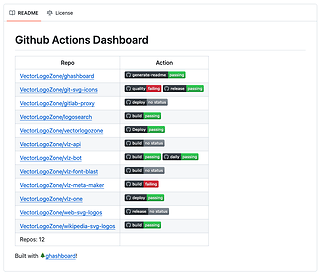
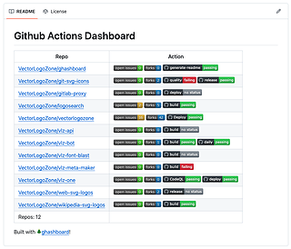

# Github Actions Dashboard (aka ghashboard) 

A tool for making dashboard pages with all the badges from your Github Actions.

## Examples

[](docs/images/screenshots/08_result.png "Example w/defaults")
[](docs/images/screenshots/10_customized_result.png "Example w/additional external badges")

## Using via CLI

Download the latest version from the [Github Releases page](https://github.com/fileformat/ghashboard/releases)

A sample command:
```
export GITHUB_TOKEN=github_pat_blah...blah
ghashboard --owners=google,spf13
```

## Using via Github Actions

Recursion detected:  Stack overflow!  ...just kidding!  This is actually a great way to run it.

Source code is worth a thousand words: see the [demo repo](https://github.com/)

## Developing

See `run.sh` for how I run it during development.

## Contributing

Contributions welcome!

## License

[MIT](LICENSE.txt)

## Credits

[](https://getbootstrap.com/ "HTML/CSS Framework")
[](https://git-scm.com/ "Version control")
[](https://github.com/ "Code hosting")
[](https://golang.org/ "Programming language")
[](https://github.com/googlefonts/noto-emoji/ "Logo")
[](https://www.jekyllrb.com/ "Static website builder")
[](https://nodeping.com?rid=201109281250J5K3P "Uptime monitoring")
[](https://www.vectorlogo.zone/ "Logos")

* [GoReleaser](https://goreleaser.com/) - packaging for release
* [Steve Francia](https://spf13.com/) - [viper](https://github.com/spf13/viper)
* [Steve Francia](https://spf13.com/) - [cobra](https://github.com/spf13/cobra)
* See [`go.mod`](https://github.com/fileformat/social-post/blob/main/go.mod) for other golang modules used
* [jq](https://jqlang.github.io/jq/) - JSON manipulation
* [cb](https://github.com/niedzielski/cb) - clipboard utility
